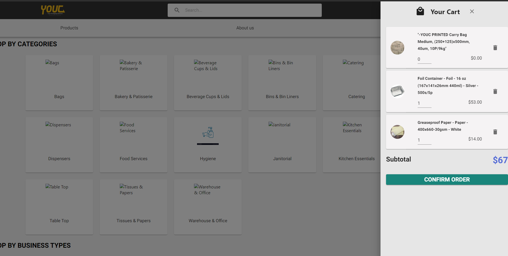
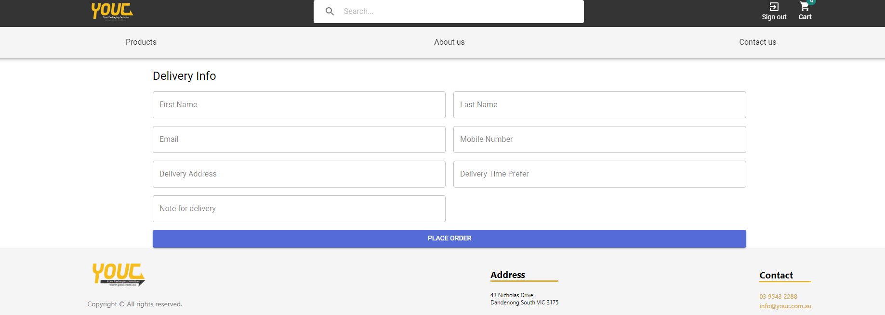

# User documentation

## Login system
If customer is already a member of YouC and familiar with YouC online order system. Login will lead customers to the login page of YouC online order.
Otherwise, if customers are new to YouC system, they can browse through products from YouC eStore, add any products they like to cart and register for an account when they want to check out.

## Navigation bar
There are 3 pages in YouC eStore navigation bar: Products page, About us and Contact Us. The ```Products``` page, also the home page when customer first access the website, shows all products in YouC eStore system, and they are categorized carefully for the best experience of customers. The ```About Us``` page, contains all information about what YouC eStore is, and what types of products the website is providing as well as some shopping policies. The ```Contact Us``` page contains all information of how to contact YouC, or where the location of the warehouse is

## Cart Drawer
Cart Drawer shows all products customers added to their shopping bag. Customers can access cart drawer by clicking on the cart icon on top right of their screen.

In cart drawer, customers can choose to remove any products they don't want to buy anymore, or change quantity of any products if they want to.

## Checkout
In order to process to check out, customers need to access ```Cart Drawer```, and then click the 'CONFIRM ORDER' button when they are ready to checkout. The button will ask them to reconfirming the order, then lead them to fill in delivery information form.

After filling in all delivery information, confirm the order by clicking the 'PLACE ORDER' button, the website will response with the customer order number.